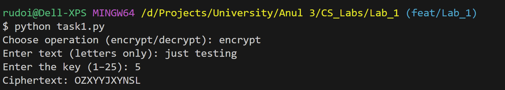
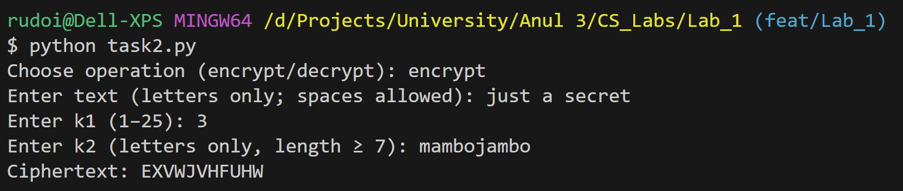

# 🔤 Classical Ciphers & Caesar Cipher

### **Course**: Cryptography and Security  
### **Author**: Alexandru Rudoi  

📑 **[👉 Read the Full Report](https://github.com/AlexandruRudoi/CS_Labs/blob/main/Lab_1/docs/CS_Lab1_Report.pdf)**  

---

## 📖 **Overview**
This project demonstrates the implementation of classical substitution ciphers, focusing on the Caesar cipher and its enhanced variant with permutation keywords. It includes:
- **Standard Caesar Cipher**: Basic substitution using modular arithmetic with shift key k₁.
- **Enhanced Caesar Cipher**: Extended version using permutation keyword k₂ to increase cryptographic complexity.
- **Input Validation**: Robust text processing and key validation mechanisms.

---

## 🎯 **Objectives**
- Implement a **standard Caesar cipher** with shift-based substitution.
- Develop an **enhanced Caesar cipher** using permutation keywords.
- Apply **modular arithmetic principles** for encryption/decryption operations.
- Create **robust input validation** for text and cryptographic keys.
- Understand **classical cryptography vulnerabilities** and resistance mechanisms.

---

## 🔧 **Implementation Details**

### 🏗 **Task 1.1: Standard Caesar Cipher**
The basic Caesar cipher shifts each letter by a fixed number of positions in the alphabet.  
**Mathematical Formula**:
```
Encryption: C = (M + k₁) mod 26
Decryption: M = (C - k₁) mod 26
```

### 🔄 **Task 1.2: Caesar Cipher with Permutation Keyword**
Enhanced version that first permutes the alphabet using keyword k₂, then applies Caesar shift k₁.  
**Key Requirements**:
- **k₁**: Shift key (1-25)
- **k₂**: Keyword (≥7 letters, creates permuted alphabet)

### ✅ **Code Snippet (Enhanced Caesar Encryption)**
```python
def build_perm_from_k2(k2: str):
    """Build permuted alphabet from keyword k2."""
    k2u = k2.upper()
    seen = set()
    perm = []
    # Add unique letters from keyword first
    for ch in k2u:
        if ch in ALPHABET and ch not in seen:
            seen.add(ch)
            perm.append(ch)
    # Add remaining letters in natural order
    for ch in ALPHABET:
        if ch not in seen:
            perm.append(ch)
    
    L2N = {ch: i for i, ch in enumerate(perm)}
    N2L = {i: ch for i, ch in enumerate(perm)}
    return perm, L2N, N2L

def caesar2_encrypt(plaintext: str, k1: int, k2: str) -> str:
    """Encrypt using permuted alphabet with Caesar shift."""
    _, L2N, N2L = build_perm_from_k2(k2)
    P = normalize_text(plaintext)
    result = []
    for ch in P:
        x = L2N[ch]           # Position in permuted alphabet
        y = (x + k1) % 26     # Apply Caesar shift
        result.append(N2L[y])
    return "".join(result)
```

### 🛡️ **Security Analysis**
- **Standard Caesar**: 25 possible keys (easily breakable)
- **Enhanced Caesar**: 26! × 25 ≈ 4.0 × 10²⁸ possible combinations
- **Resistance**: Significantly improved against brute-force attacks

---

## 🖼 **Execution Results**

### Task 1.1 - Standard Caesar Cipher


### Task 1.2 - Enhanced Caesar with Permutation


---

## 🏁 **How to Run the Project**
1. **Clone the repository**:
   ```cmd
   git clone https://github.com/AlexandruRudoi/CS_Labs.git
   cd CS_Labs\Lab_1
   ```
2. **Run Task 1 (Standard Caesar)**:
   ```cmd
   python task1.py
   ```
3. **Run Task 2 (Enhanced Caesar)**:
   ```cmd
   python task2.py
   ```

### **Example Usage**
```
Choose operation (encrypt/decrypt): encrypt
Enter text (letters only; spaces allowed): Hello World
Enter k1 (1–25): 3
Enter k2 (letters only, length ≥ 7): KEYWORD
Ciphertext: MJQQT BTWQE
```

---

## 🔍 **Key Features**
- ✅ **Modular Arithmetic**: Proper wrap-around behavior for alphabet boundaries
- ✅ **Input Validation**: Comprehensive checks for text and key parameters
- ✅ **Text Normalization**: Automatic uppercase conversion and space removal
- ✅ **Alphabet Mapping**: Explicit letter-to-index conversion (no ASCII arithmetic)
- ✅ **Permutation Logic**: Dynamic alphabet reordering based on keywords
- ✅ **Error Handling**: Robust user input validation with retry mechanisms

---

## 🎓 **Conclusion**
This laboratory work provided hands-on experience with classical cryptography fundamentals. The implementation of both standard and enhanced Caesar ciphers demonstrated:
- **Modular arithmetic applications** in cryptographic systems
- **Permutation-based security improvements** over simple substitution
- **Practical programming techniques** for cryptographic algorithm implementation
- **Input validation importance** in secure system design

The enhanced Caesar cipher with permutation keywords significantly increases key space complexity, showing how classical techniques can be improved while maintaining computational simplicity.

---

## 📚 **References**
- **Course Materials** – *Cryptography and Security*, UTM FCIM, 2025
- **Wikipedia** – [Caesar Cipher](https://en.wikipedia.org/wiki/Caesar_cipher)
- **William Stallings** – *Cryptography and Network Security: Principles and Practice*